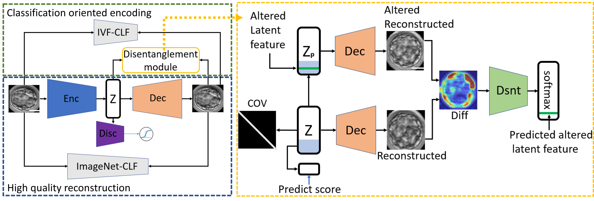
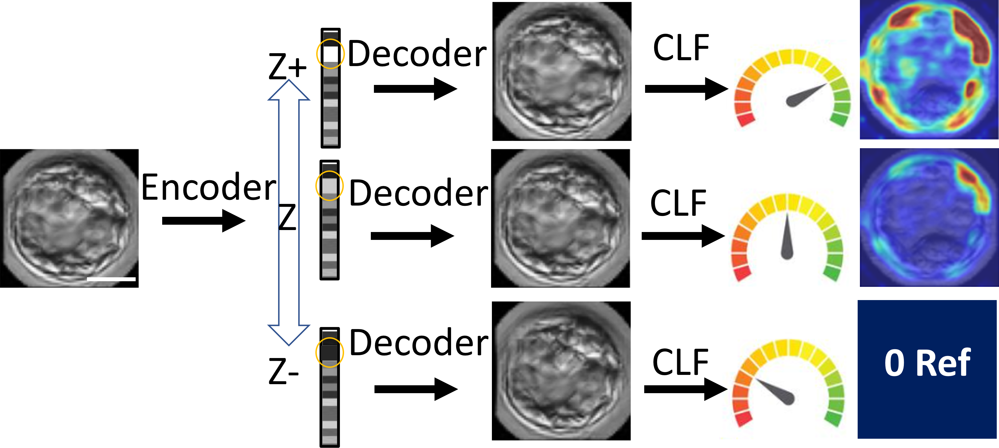
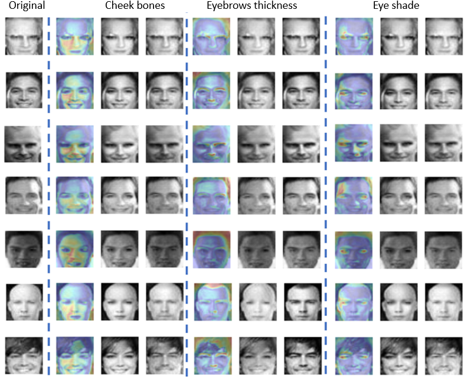

# DISCOVER: Visual interpretability of image-based classification models 
Official Tensorflow2 implementation of: Visual interpretability of image-based classification models by generative latent space disentanglement applied to in vitro fertilization

## Main requirements
* Python 3.9.10
* tensorflow 2.6.2

## Method Overview
DISCOVER is a designated general-purpose interpretability “discovery machine” especially geared toward quantitative interpretation 
of known and new classification-driving semantic image properties. 
DISCOVER is a generative model that learns representations designed to discover the underlying visual properties driving image-based
classification models. The main innovation of our method is a disentangling module that optimizes a classification-driven and disentangled
latent representation, where a subset of latent features encapsulates the discriminative information of the classification model, 
and where each of these latent features encodes a distinct visual property in the image that is important for classification and that
is distinct from the ones encoded by other latent features.

## Inference
* Counterfactual visual explanation by latent feature traversal

## IVF Interpretation

## GENDER faces Interpretation

## Training celebA or other custom data
* Download celebA data: https://mmlab.ie.cuhk.edu.hk/projects/CelebA.html and save images in 'IMAGES' folder according to current split (MALE_TRAIN/FEMALE_TRAIN/MALE_TEST/FEMALE_TEST) 
* To train the classifier with celebA data:  use 'GENDER_CLF_TRAINING.ipynb'. Update 'data_path' prefix and run notebook.
* To train DISCOVER with trained classifier: use 'GENDER_DISCOVER_TRAINING.ipynb'. Update 'data_path' prefix and update 'GENDER_CLF_SAVED_MODEL.h5' saved model. Run notebook.
* To analyze and interpret results:          use 'GENDER_ANALYSIS.ipynb'. update 'data_path' prefix and GENDER_CLF_SAVED_MODEL.h5 and 'GENDER_DISCOVER_SAVED_MODELS'. Run notebook.

## Licence

This work is released under the MIT licence.

