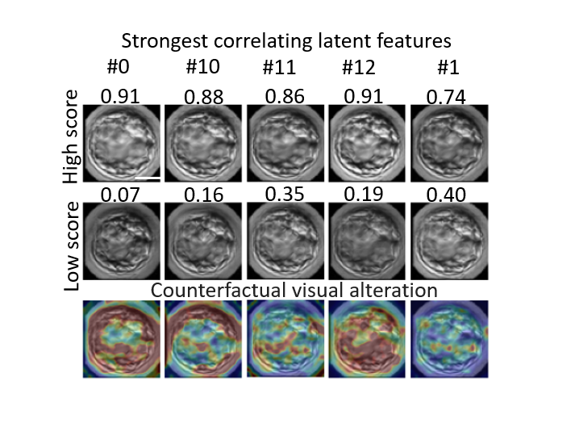

# DISCOVER: Visual interpretability of image-based classification models 
Official Tensorflow2 implementation of: Visual interpretability of image-based classification models by generative latent space disentanglement applied to in vitro fertilization

## Requirements
Python 3.9.10
tensorflow 2.6.2

## IVF analysis

## GENDER faces analysis

## Licence

This work is released under the MIT licence.

